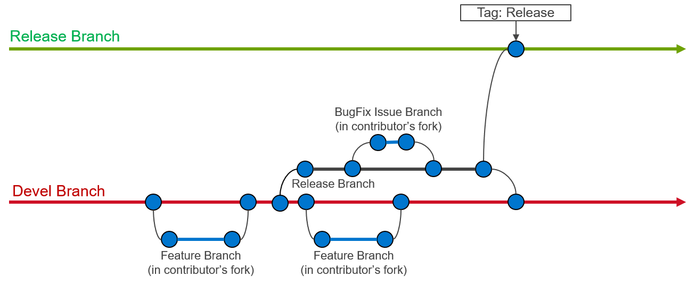

# CONTRIBUTE

## Introduction
We encourage everyone to help us improve Omnia by contributing to the project. Contributions can be as small as documentation updates or adding example use cases, to adding commenting or properly styling code segments, to full feature contributions. We ask that contributors follow our established guidelines for contributing to the project.

These guidelines are based on the [pravega project](https://github.com/pravega/pravega/).

This document will evolve as the project matures. Please be sure to regularly refer back in order to stay in-line with contribution guidelines.

## How to Contribute to Omnia
Contributions to Omnia are made through [Pull Requests (PRs)](https://help.github.com/en/github/collaborating-with-issues-and-pull-requests/about-pull-requests). To make a pull request against Omnia, use the following steps:

1. **Create an issue:** [Create an issue](https://help.github.com/en/github/managing-your-work-on-github/creating-an-issue) and describe what you are trying to solve. It does not matter whether it is a new feature, a bug fix, or an improvement. All pull requests need to be associated to an issue. When creating an issue, be sure to use the appropriate issue template (bug fix or feature request) and complete all of the required fields. If your issue does not fit in either a bug fix or feature request, then create a blank issue and be sure to including the following information:
   * **Problem description:** Describe what you believe needs to be addressed
   * **Problem location:** In which file and at what line does this issue occur?
   * **Suggested resolution:** How do you intend to resolve the problem?
2. **Create a personal fork:** All work on Omnia should be done in a [fork of the repository](https://help.github.com/en/github/getting-started-with-github/fork-a-repo). Only the maintiners are allowed to commit directly to the project repository.
3. **Issue branch:** [Create a new branch](https://help.github.com/en/desktop/contributing-to-projects/creating-a-branch-for-your-work) on your fork of the repository. All contributions should be branched from `devel`. Use `git checkout devel; git checkout -b <new-branch-name>` to create the new branch.
   * **Branch name:** The branch name should be based on the issue you are addressing. Use the following pattern to create your new branch name: issue-number, e.g., issue-1023.
4. **Commit changes to the issue branch:** It is important to commit your changes to the issue branch. Commit messages should be descriptive of the changes being made.
   * **Signing your commits:** All commits to Omnia need to be signed with the [Developer Certificate of Origin (DCO)](https://developercertificate.org/) in order to certify that the contributor has permission to contribute the code. In order to sign commits, use either the `--signoff` or `-s` option to `git commit`:
   ```
   git commit --signoff
   git commit -s
   ```
   Make sure you have your user name and e-mail set. The `--signoff | -s` option will use the configured user name and e-mail, so it is important to configure it before the first time you commit. Check the following references:

      * [Setting up your github user name](https://help.github.com/articles/setting-your-username-in-git/)
      * [Setting up your e-mail address](https://help.github.com/articles/setting-your-commit-email-address-in-git/)
   
5. **Push the changes to your personal repo:** To be able to create a pull request, push the changes to origin: `git push origin <new-branch-name>`. Here I assume that `origin` is your personal repo, e.g., `lwilson/omnia.git`.
6. **Create a pull request:** [Create a pull request](https://help.github.com/en/github/collaborating-with-issues-and-pull-requests/creating-a-pull-request) with a title following this format Issue ###: Description (_i.e., Issue 1023: Reformat testutils_). It is important that you do a good job with the description to make the job of the code reviewer easier. A good description not only reduces review time, but also reduces the probability of a misunderstanding with the pull request.
   * **Important:** When preparing a pull request it is important to stay up-to-date with the project repository. We recommend that you rebase against the upstream repo _frequently_. To do this, use the following commands:
   ```
   git pull --rebase upstream master #upstream is dellhpc/omnia
   git push --force origin <pr-branch-name> #origin is your fork of the repository (e.g., <github_user_name>/omnia.git)
   ```
   * **PR Description:** Be sure to fully describe the pull request. Ideally, your PR description will contain:
      1. A description of the main point (_e.g., why was this PR made?_),
      2. Linking text to the related issue (_e.g., This PR closes issue #<issue_number>_),
      3. How the changes solves the problem, and
      4. How to verify that the changes work correctly.
   
### Omnia Branches and Contribution Flow
The diagram below describes the contribution flow. Omnia has two lifetime branches: `devel` and `master`. The `master` branch is reserved for releases and their associated tags. The `devel` branch is where all development work occurs. The `devel` branch is also the default branch for the project.


