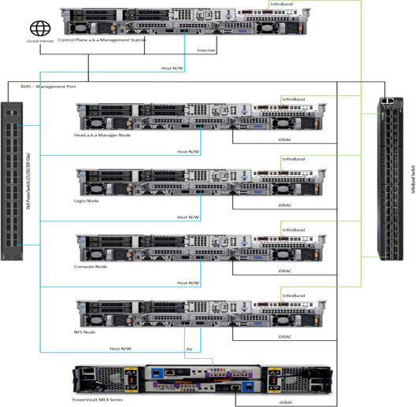

# Network Topology: Dedicated NIC Setup

When the control plane has a separate NIC connected to ToR for Device Management to control various devices like iDRAC, switches and PowerVault, separate switches for management and host network are used. Omnia will run the management network POD for this network. An additional unmanaged switch is needed as a pass through switch.

Depending on internet access for host nodes, there are two ways to achieve a dedicated NIC setup:
1. Dedicated Setup with dedicated public NIC on compute nodes  
When all compute nodes have their own public network access, `primary_dns` and `secondary_dns` in `base_vars.yml` become optional variables as the control plane is not required to be a gateway to the network. The network design would follow the below diagram:  

2. Dedicated Setup with single NIC on compute nodes  
When all compute nodes rely on the control plane for public network access, the variables `primary_dns` and `secondary_dns` in `base_vars.yml` are used to indicate that the control plane is the gateway for all compute nodes to get internet access. Since all public network traffic will be routed through the control plane, the user may have to take precautions to avoid bottlenecks in such a set up.  

## Control plane configuration
Depending on the user input in `base_vars.yml`, the below table explains the outcomes of running `control_plane.yml` to configure the network:  

<table>
<thead>
  <tr>
   <th>network_interface_type</th>
   <th>device_config_support</th>
   <th>idrac_support</th>
   <th>Outcome</th>
   <th>One Touch Config Support</th>
  </tr>
</thead>
<tbody>
  <tr>
   <td rowspan="4">Dedicated</td>
   <td>TRUE</td>
   <td>TRUE</td>
   <td>Omnia  will assign IPs to all the management ports of the different devices. iDRAC  and PXE provisioning is supported. Here, ethernet, InfiniBand and powervault  configurations are supported.</td>
   <td>Yes</td>
  </tr>
  <tr>
   <td>TRUE</td>
   <td>FALSE</td>
   <td>An assert  failure on control_plane_common will manifest and Omnia Control Plane will  fail.</td>
   <td>No</td>
  </tr>
  <tr>
   <td>FALSE</td>
   <td>TRUE</td>
   <td>Assuming  the device_ip_list is populated, mgmt_container will not be used to assign  the IPs to all the mgmt ports as a device_ip_list indicates that IP  assignment is already done. However, ethernet, InfiniBand, powervault  configurations are supported.</td>
   <td>Yes</td>
  </tr>
  <tr>
   <td>FALSE</td>
   <td>FALSE</td>
   <td>No IPs  will be assigned by Omnia. Provisioning will only be through PXE.</td>
   <td>No</td>
  </tr>
</tbody>
</table>

>> **Note**: If `device_config_support` is false (ie, no management container is set up), no IPs will be assigned by Omnia. If a device IP list is provided, provisioning will only be through PXE. 