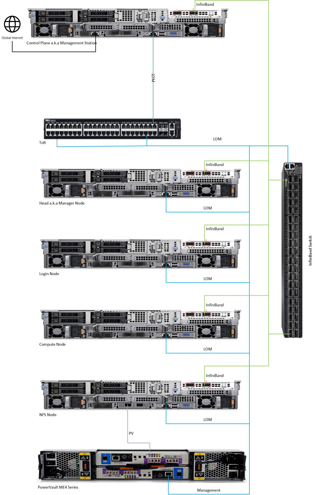

# Network Topology: LOM Setup

A LOM port could be shared with the host operating system production traffic. Also, LOM ports can be dedicated to server management. For example, with a four-port LOM adapter, LOM ports one and two could be used for production data while three and four could be used for iDRAC, VNC, RDP, or other operating system-based management data. 
   

Depending on the availability of a dedicated high speed network for data and provisioning, there are two ways to set up a shared LOM environment:
1. With a dedicated high speed network: When there's a dedicated data path, the variables `roce_network_nic`, `roce_network_dhcp_start_range` and `roce_network_dhcp_end_range` are required to set up the data path and route provisioning information appropriately.
2. Without a dedicated high speed network: The variables `roce_network_nic`, `roce_network_dhcp_start_range` and `roce_network_dhcp_end_range` are left blank to indicate that all provisioning data is to be routed through the host network.

## Control plane configuration
Depending on the user input in `base_vars.yml`, the below table explains the outcomes of running `control_plane.yml` to configure the network:  

<table>
<thead>
  <tr>
    <th>Network Setup</th>
    <th>High speed data network available?</th>
    <th>Outcome</th>
    <th>One Touch Configuration Support</th>
  </tr>
</thead>
<tbody>
  <tr>
    <td rowspan="2">lom</td>
    <td>Yes</td>
    <td>When roce_network_nic is populated, management network container will come up, and it will be used to assign the management and data port IPs. This will provide internet connection if DNS settings are filled in base_vars.yml. Along with this , Cobbler PXE provisioning will be done over the high speed data path or roce.</td>
    <td>No</td>
  </tr>
  <tr>
    <td>No</td>
    <td>When roce_network_nic is not populated, cobbler container will come up and will be responsible for mgmt. and data IP assignment as well as for providing the DNS configurations( if the parameters are given)</td>
    <td>No</td>
  </tr>
</tbody>
</table>

>> **Note**:
>> * When `network interface` type is `lom`, `idrac_support` is assumed to be true irrespective of user input.
>> * Omnia will not automatically assign IPs to all devices (powervault or ethernet/Infiniband switches) when `network_interface_type` is lom. However, if required, users can follow the [linked steps](Installation_Guides/USING_PLAYBOOKS.md#setting-up-static-ips-on-devices-when-the-network-interface-type-is-shared-lom).
>> * Despite the value of `mgmt_network_nic` and `host_network_nic` being the same in LOM environments, the IPs assigned for management and data should not be in the same range. The start and end values of the management IP range and the host IP range cannot be the same.
