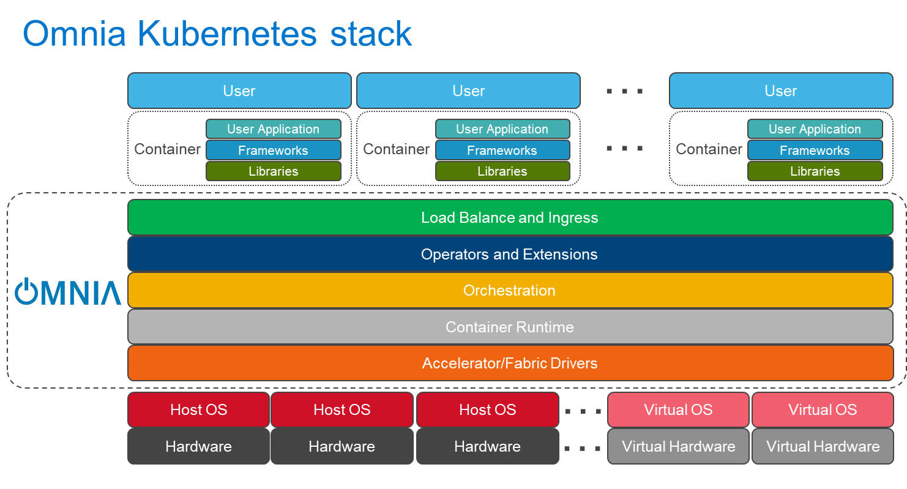
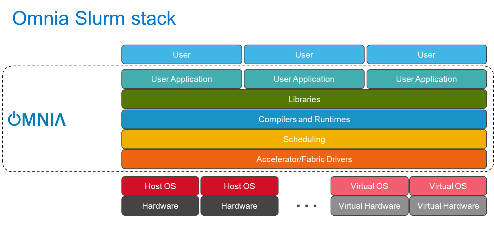

**Omnia** (Latin: all or everything) is a deployment tool to configure Dell EMC PowerEdge servers running standard RPM-based Linux OS images into cluster capable of supporting HPC, AI, and data analytics workloads. Omnia installs Slurm and/or Kubernetes for managing jobs and enables installation of many other packages and services for running diverse workloads on the same converged solution. Omnia is a collection of [Ansible](https://ansible.org) playbooks, is open source, and is constantly being extended to enable comprehensive workloads.

## What Omnia Does
Omnia can build clusters which use Slurm or Kubernetes (or both!) for workload management. Omnia will install software from a variety of sources, including:
- Standard CentOS and [ELRepo](http://elrepo.org) repositories
- Helm repositories
- Source code compilation
- [OpenHPC](https://openhpc.community) repositories (_coming soon!_)
- [OperatorHub](https://operatorhub.io) (_coming soon!_)

Whenever possible, Omnia will opt to leverage existing projects rather than reinvent the wheel.

### Omnia Stacks
Omnia can install Kubernetes or Slurm (or both), along with additional drivers, services, libraries, and user applications.

 

## Installing Omnia
Omnia requires that servers already have an RPM-based Linux OS running on them, and are all connected to the Internet. Currently all Omnia testing is done on [CentOS](https://centos.org). Please see [PREINSTALL](PREINSTALL.md) for instructions on network setup.

Once servers have functioning OS and networking, you can using Omnia to install and start Slurm and/or Kubernetes. Please see [INSTALL](INSTALL.md) for instructions.

## Contributing to Omnia
The Omnia project was started to give members of the [Dell Technologies HPC Community](https://dellhpc.org) a way to easily setup clusters of Dell EMC servers, and to contribute useful tools, fixes, and functionality back to the HPC Community.

### Open to All
While we started Omnia within the Dell Technologies HPC Community, that doesn't mean that it's limited to Dell EMC servers, networking, and storage. This is an open project, and we want to encourage *everyone* to use and contribute to Omnia!

### Anyone Can Contribute!
It's not just new features and bug fixes that can be contributed to the Omnia project! Anyone should feel comfortable contributing. We are asking for all types of contributions:
* New feature code
* Bug fixes
* Documentation updates
* Feature suggestions
* Feedback
* Validation that it works for your particular configuration

If you would like to contribute, see [CONTRIBUTING](https://github.com/dellhpc/omnia/blob/devel/CONTRIBUTING.md).

### [Omnia Contributors](CONTRIBUTORS.md)
