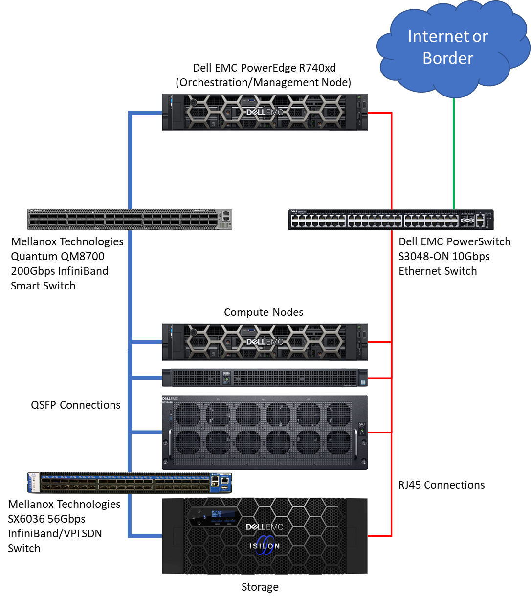

## Example system designs
Omnia can configure systems which use Ethernet or Infiniband-based fabric to connect the compute servers.

## Internet Access
Since Omnia 1.2, only the control plane requires internet access. In such a situation, the network topology would follow the below diagram:

If the user would like to have all compute nodes connect to the internet, the following network diagram can be followed.

### Network Topology
Possible network configurations include:

#### Shared LOM 
  

<table>
<thead>
  <tr>
   <th>network_interface_type</th>
   <th>device_config_support</th>
   <th>idrac_support</th>
   <th>Outcome</th>
   <th>One Touch Config Support</th>
  </tr>
</thead>
<tbody>
  <tr>
   <td rowspan="4">lom</td>
   <td rowspan="2">TRUE</td>
   <td rowspan="4">TRUE</td>
   <td>When  roce_nic_ip is populated, Omnia will assign IPs to both the management and  data ports. Cobbler/pxe provisioning will be done via the roce_network_nic.</td>
   <td>Yes</td>
  </tr>
  <tr>
   <td>When  roce_nic_ip is not populated, the cobbler container will be used to assign  IPs to both the iDRAC management port and the data ports. Both iDRAC and pxe  mode of provisioning are supported. </td>
   <td>No</td>
  </tr>
  <tr>
   <td rowspan="2">FALSE</td>
   <td>When  roce_nic_ip is populated, management network container will come up, and it  will be used to assign the management and data port IPs. This will provide  internet connection if DNS settings are filled in base_vars.yml. Along with  this , Cobbler PXE provisioning will be done over the high speed data path or  roce.</td>
   <td>No</td>
  </tr>
  <tr>
   <td>When  roce_nic_ip is not populated, cobbler container will come up and will be  responsible for mgmt. and data IP assignment as well as for providing the DNS  configurations( if the parameters are given)</td>
   <td>No</td>
  </tr>
</tbody>
</table>

>> __Note:__ Currently, auto configuration of devices like ethernet and IB switches, PowerVault ME4 are not supported in a lom setup.

#### Dedicated NICs
  
When the control plane has a separate NIC connected to ToR for Device Management to control various devices like iDRAC, switches and PowerVault, separate switches for management and host network are used. Omnia will run the management network POD for this network. An additional unmanaged switch is needed as a pass through switch.

<table>
<thead>
  <tr>
   <th>network_interface_type</th>
   <th>device_config_support</th>
   <th>idrac_support</th>
   <th>Outcome</th>
   <th>One Touch Config Support</th>
  </tr>
</thead>
<tbody>
  <tr>
   <td rowspan="4">Dedicated</td>
   <td>TRUE</td>
   <td>TRUE</td>
   <td>Omnia  will assign IPs to all the management ports of the different devices. iDRAC  and PXE provisioning is supported. Here, ethernet, InfiniBand and powervault  configurations are supported.</td>
   <td>Yes</td>
  </tr>
  <tr>
   <td>TRUE</td>
   <td>FALSE</td>
   <td>An assert  failure on control_plane_common will manifest and Omnia Control Plane will  fail.</td>
   <td>No</td>
  </tr>
  <tr>
   <td>FALSE</td>
   <td>TRUE</td>
   <td>Assuming  the device_ip_list is populated, mgmt_container will not be used to assign  the IPs to all the mgmt ports as a device_ip_list indicates that IP  assignment is already done. However, ethernet, InfiniBand, powervault  configurations are supported.</td>
   <td>Yes</td>
  </tr>
  <tr>
   <td>FALSE</td>
   <td>FALSE</td>
   <td>No IPs  will be assigned by Omnia. Provisioning will only be through PXE.</td>
   <td>No</td>
  </tr>
</tbody>
</table>

>> __Note:__ If `device_config_support` is false (ie, no management container is set up), no IPs will be assigned by Omnia. If a device IP list is provided, provisioning will only be through PXE. 