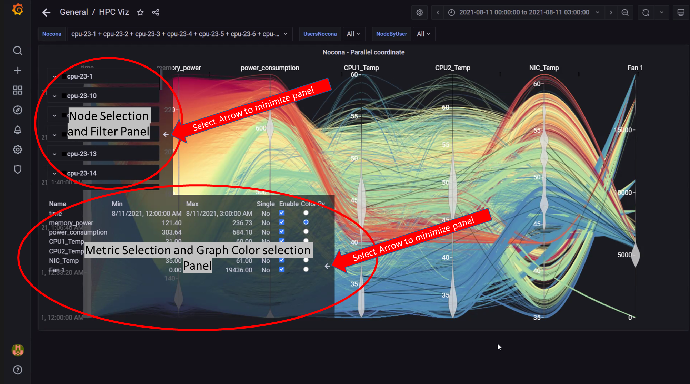
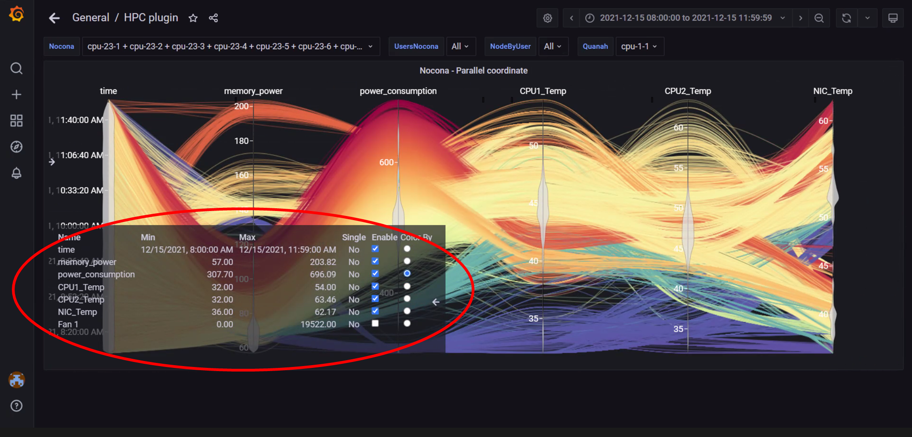
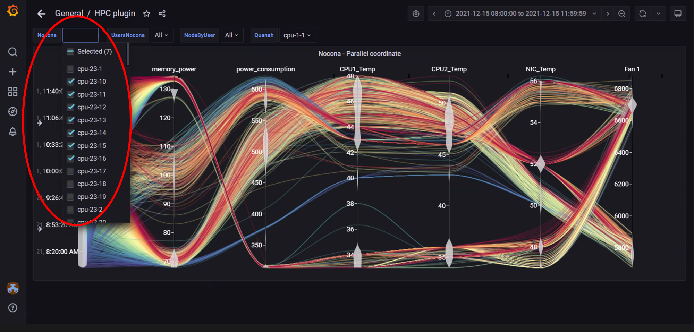
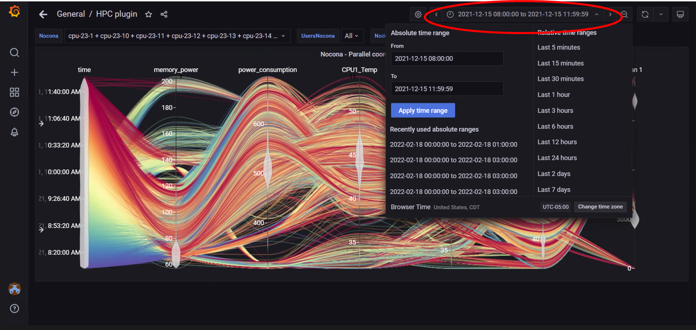

# Parallel Coordinates
Parallel coordinates are a great way to visualize multiple metric dimensions simultaneously to see trends and spot outlier activity. Metrics like CPU temp, Fan Speed, Memory Usage etc. can be added or removed as an additional vertical axis.  This implementation of parallel coordinate graphing includes a display of metric value distribution in the form of a violin plot along vertical axes and the ability to interact with the graph to perform filtering. Metric range filtering on one or more axes automatically filters the node and sample list in the top left-hand panel to the nodes and samples that fit the filtering criteria.

## Interacting with the graph

>> __Note:__ In the above image, both left-hand panels are collapsed to allow for a better view of the graph. They can be expanded by clicking on the arrows highlighted in the picture. The expanded panels can be used to customize the graph.

>> __Note:__ In the above image, both left-hand panels are expanded and can be minimized by clicking on the minimize arrows on the right of each panel. These panels can be used to customize the graphs by:
>> 1. Filtering by node and node metrics
>> 2. Assigning colors to different node metrics

>> __Note:__ In the above image, the metric __Power Consumption__ has been assigned a color to highlight the metric.

>> __Note:__ In the above image, data has been filtered by __Node__ to get insights into different metrics about specific nodes.

>> __Note:__ In the above image, data for a single node has been highlighted using the top-left panel.

>> __Note:__ In the above image, metric filters were applied on __Power Consumption__ by clicking on the vertical axis and dragging a filter box over the range of values required. The top left panel will display nodes and samples that fit the filter.  Filters are removed by clicking on the vertical dimension axis again.

>> __Note:__ In the above image, metric filters were applied on __Power Consumption__ and __NIC temperature__ . Using more than one filter will result in fewer nodes and telemetry samples that meet the filtering criteria.

>> __Note:__ In the above image, the top-right panel was used to filter data by time, this can be done in 2 ways:
>> 1. In absolute yyyy-mm-dd hh:mm:ss format
>> 2. In relative time periods such as 'last 5 minutes', 'last 7 days' etc.

